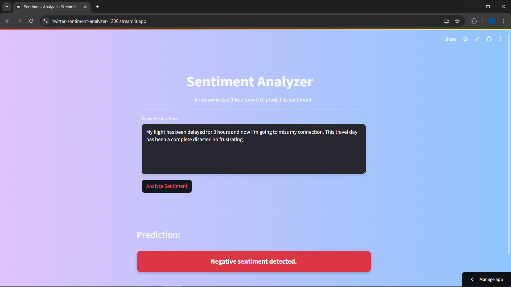

# Twitter Sentiment Analyzer

[](https://lavanyadhiman-twitter-sentiment-analyzer-1206.streamlit.app/)

A simple web application built with Streamlit to analyze the sentiment of text, such as tweets. The app classifies a given text as either **Positive** or **Negative** based on a machine learning model trained on the Sentiment140 dataset.



---

## Features

-   **Real-time Sentiment Prediction:** Instantly analyze the sentiment of any text you provide.
-   **Simple & Clean UI:** An easy-to-use interface built with Streamlit.
-   **Efficient Model:** Uses a `Bernoulli Naive Bayes` classifier, which is fast and effective for text classification tasks.
-   **Large-Scale Training:** The model was trained on the extensive **Sentiment140 dataset**, containing 1.6 million tweets.

---

## Model & Dataset

### Machine Learning Model

The sentiment prediction is powered by a `Bernoulli Naive Bayes` model from the Scikit-learn library.

-   **Text Vectorization:** The input text is processed using a `TfidfVectorizer` which converts text into numerical features. It was configured to consider the 5,000 most frequent words and word pairs (n-grams of 1 and 2).
-   **Model Performance:** On a test set of 320,000 tweets, the model achieved an accuracy of approximately **77%**.

### Dataset: Sentiment140

The model was trained on the popular Sentiment140 dataset, which can be found on Kaggle.

-   **Source:** [Sentiment140 Dataset on Kaggle](https://www.kaggle.com/datasets/kazanova/sentiment140?resource=download)
-   **Content:** It contains **1,600,000 tweets** extracted using the Twitter API.
-   **Annotations:** The tweets are annotated with their sentiment polarity:
    -   `0` = Negative
    -   `4` = Positive
-   **Preprocessing:** For this project, the neutral tweets were removed, and the polarity labels were mapped to `0` for negative and `1` for positive. All text was converted to lowercase for consistency.

---

## Tech Stack

-   **Language:** Python 3
-   **Web Framework:** Streamlit
-   **Machine Learning:** Scikit-learn
-   **Data Manipulation:** Pandas

---

## Setup & Run Locally

To run this application on your local machine, follow these steps:

**1. Clone the Repository**

```bash
git clone [https://github.com/lavanyadhiman/twitter-sentiment-analyzer.git](https://github.com/lavanyadhiman/twitter-sentiment-analyzer.git)
cd twitter-sentiment-analyzer
```

**2. Create a Virtual Environment (Recommended)**

It's good practice to create a virtual environment to manage project dependencies.

```bash
# For Windows
python -m venv venv
venv\Scripts\activate

# For macOS/Linux
python3 -m venv venv
source venv/bin/activate
```

**3. Install Dependencies**

The `requirements.txt` file contains all the necessary Python packages.

```bash
pip install -r requirements.txt
```

**4. Run the Streamlit App**

Once the dependencies are installed, you can start the application.

```bash
streamlit run app.py
```

Your web browser should automatically open a new tab with the running application.

---

## Project Structure

```
.
├── model/
│   ├── sentiment_model.pkl   # The trained BernoulliNB model
│   └── vectorizer.pkl        # The fitted TF-IDF vectorizer
├── app.py                    # The main Streamlit application script
├── requirements.txt          # Project dependencies
└── README.md                 # You are here!
```

---

## Dataset Citation

Go, A., Bhayani, R. and Huang, L., 2009. *Twitter sentiment classification using distant supervision.* CS224N Project Report, Stanford, 1(2009), p.12.

